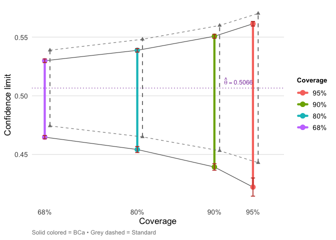

<!-- README.md is generated from the source: README.Rmd -->

# bcaboot 

<!-- badges: start -->

[](https://cran.r-project.org/package=bcaboot)
[](https://cloud.r-project.org/package=bcaboot)
[](https://github.com/bnaras/bcaboot/actions/workflows/R-CMD-check.yaml)
<!-- badges: end -->

Bias-corrected and accelerated (BCa) bootstrap confidence intervals,
computed almost automatically. The package provides two main functions:

- `bca_nonpar()` for nonparametric bootstrap
- `bca_par()` for parametric bootstrap

Results integrate with the tidyverse via `tidy()`, `glance()`, and
`autoplot()` methods.

## Installation

``` r
# From CRAN
install.packages("bcaboot")

# Development version
# install.packages("devtools")
devtools::install_github("bnaras/bcaboot")
```

## Example

``` r
library(bcaboot)

data(diabetes)
Xy <- cbind(diabetes$x, diabetes$y)
rfun <- function(Xy) {
    y <- Xy[, 11]; X <- Xy[, 1:10]
    summary(lm(y ~ X))$adj.r.squared
}

set.seed(1234)
result <- bca_nonpar(Xy, B = 2000, func = rfun, verbose = FALSE)
result
```

    ##  conf.level    bca.lo    bca.hi    std.lo    std.hi
    ##        0.95 0.4221740 0.5613841 0.4429423 0.5701783
    ##        0.90 0.4392968 0.5507219 0.4531704 0.5599503
    ##        0.80 0.4541906 0.5387434 0.4649627 0.5481579
    ##        0.68 0.4647324 0.5298461 0.4742814 0.5388392

``` r
tidy(result)
```

    ## # A tibble: 8 × 7
    ##   conf.level method   estimate conf.low conf.high jacksd.low jacksd.high
    ##        <dbl> <chr>       <dbl>    <dbl>     <dbl>      <dbl>       <dbl>
    ## 1       0.95 bca         0.507    0.422     0.561    0.00776     0.00201
    ## 2       0.95 standard    0.507    0.443     0.570   NA          NA      
    ## 3       0.9  bca         0.507    0.439     0.551    0.00280     0.00173
    ## 4       0.9  standard    0.507    0.453     0.560   NA          NA      
    ## 5       0.8  bca         0.507    0.454     0.539    0.00262     0.00157
    ## 6       0.8  standard    0.507    0.465     0.548   NA          NA      
    ## 7       0.68 bca         0.507    0.465     0.530    0.00143     0.00158
    ## 8       0.68 standard    0.507    0.474     0.539   NA          NA

``` r
library(ggplot2)
autoplot(result)
```

<!-- -->

## References

Efron, B., & Narasimhan, B. (2020). The Automatic Construction of
Bootstrap Confidence Intervals. *Journal of Computational and Graphical
Statistics*, 29(3), 608–619.
<https://doi.org/10.1080/10618600.2020.1714633>
