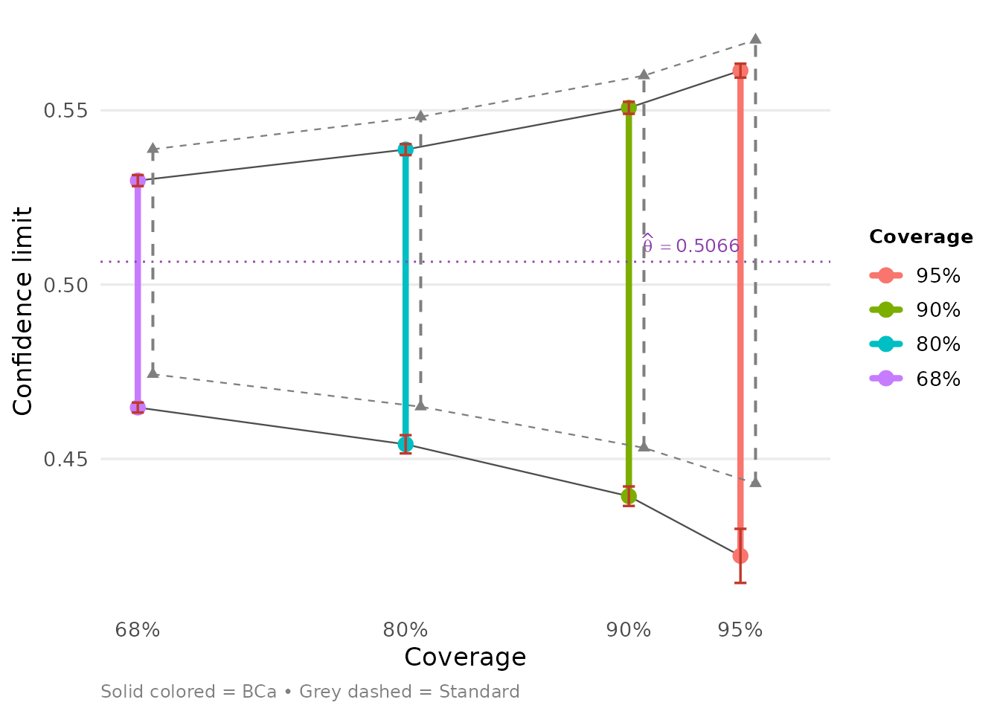
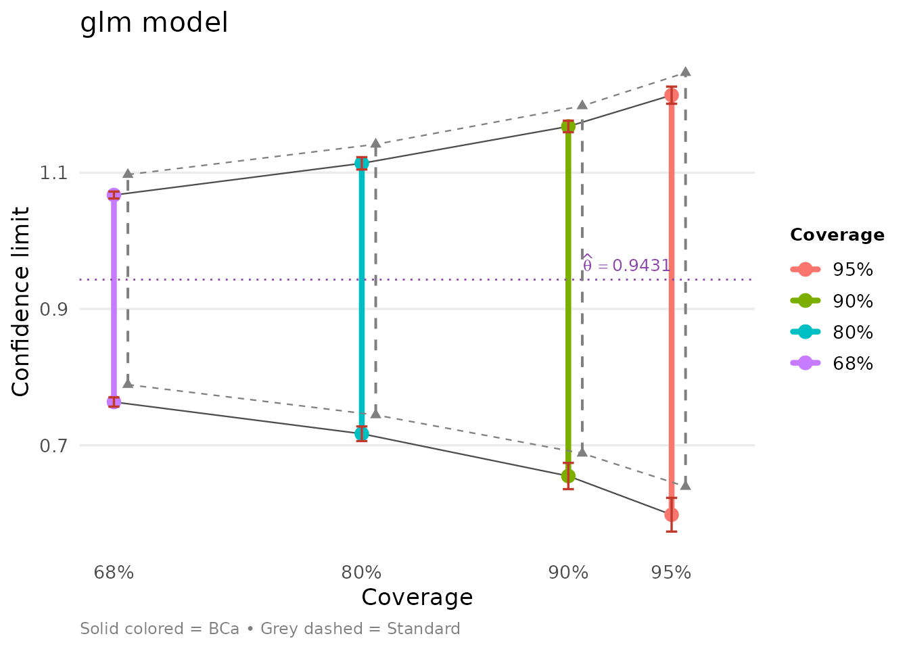
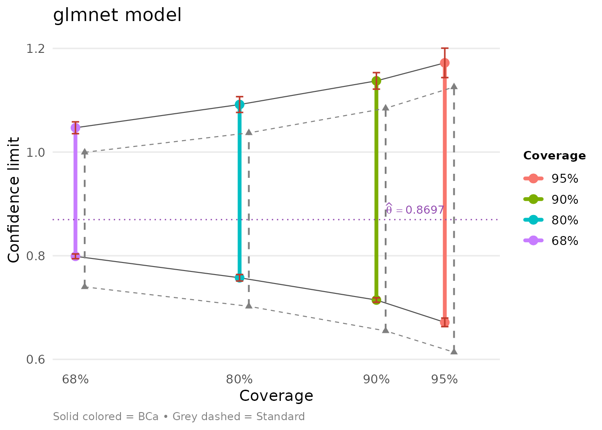
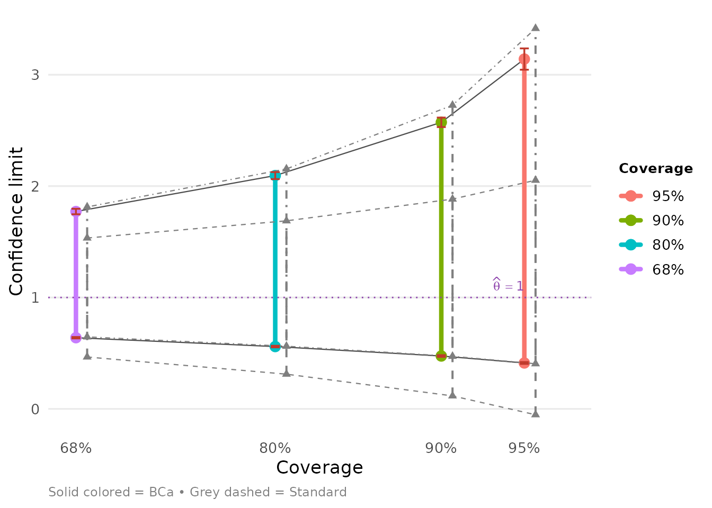

# Automatic Construction of Bootstrap Confidence Intervals

## Introduction

Bootstrap confidence intervals depend on three elements:

- the cdf of the $B$ bootstrap replications $t_{i}^{*}$, $i = 1\ldots B$
- the bias-correction number
  $z_{0} = \Phi\left( \sum_{i}^{B}I\left( t_{i}^{*} < t_{0} \right)/B \right)$
  where $t_{0} = f(x)$ is the original estimate
- the acceleration number $a$ that measures the rate of change in
  $\sigma_{t_{0}}$ as $x$, the data changes.

The first two of these depend only on the bootstrap distribution, and
not how it is generated: parametrically or non-parametrically.

Package `bcaboot` aims to make construction of bootstrap confidence
intervals *almost* automatic. The two main functions are:

- `bca_nonpar()` for nonparametric bootstrap
- `bca_par()` for parametric bootstrap

All results are returned as `bcaboot` objects with a consistent
structure and support `tidy()`, `glance()`, and
[`autoplot()`](https://ggplot2.tidyverse.org/reference/autoplot.html)
for integration with the tidyverse ecosystem.

Further details are in the Efron and Narasimhan (2018) paper. Much of
the theory behind the approach can be found in references Efron (1987),
T. DiCiccio and Efron (1992), T. J. DiCiccio and Efron (1996), and Efron
and Hastie (2016).

## A Nonparametric Example

Suppose we wish to construct bootstrap confidence intervals for an
$R^{2}$-statistic from a linear regression. Using the diabetes data from
the [`lars`](https://cran.r-project.org/package=lars) (442 by 11) as an
example, we use the function below to regress the `y` on `x`, a matrix
of of 10 predictors, to compute $R^{2}$.

``` r
data(diabetes, package = "bcaboot")
Xy <- cbind(diabetes$x, diabetes$y)
rfun <- function(Xy) {
    y <- Xy[, 11]
    X <- Xy[, 1:10]
    summary(lm(y ~ X) )$adj.r.squared
}
```

Constructing bootstrap confidence intervals involves merely calling
`bca_nonpar`:

``` r
set.seed(1234)
result <- bca_nonpar(x = Xy, B = 2000, func = rfun, verbose = FALSE)
```

The `result` prints a clean summary:

``` r
result
```

    ## BCa Bootstrap Confidence Intervals
    ##   Method: nonpar (regression acceleration)
    ##   B = 2000, theta = 0.5065603, sdboot = 0.03245877
    ## 
    ## Confidence limits:
    ##  conf.level    bca.lo    bca.hi    std.lo    std.hi
    ##        0.95 0.4221740 0.5613841 0.4429423 0.5701783
    ##        0.90 0.4392968 0.5507219 0.4531704 0.5599503
    ##        0.80 0.4541906 0.5387434 0.4649627 0.5481579
    ##        0.68 0.4647324 0.5298461 0.4742814 0.5388392
    ## 
    ## Diagnostics:
    ##   z0 = -0.2676094, a = -0.005846673, sdjack = 0.03232833

### Tidy output

The `tidy()` method returns a tibble with one row per (confidence level,
method) combination, following the broom conventions:

``` r
tidy(result)
```

    ## # A tibble: 8 × 7
    ##   conf.level method   estimate conf.low conf.high jacksd.low jacksd.high
    ##        <dbl> <chr>       <dbl>    <dbl>     <dbl>      <dbl>       <dbl>
    ## 1       0.95 bca         0.507    0.422     0.561    0.00776     0.00201
    ## 2       0.95 standard    0.507    0.443     0.570   NA          NA      
    ## 3       0.9  bca         0.507    0.439     0.551    0.00280     0.00173
    ## 4       0.9  standard    0.507    0.453     0.560   NA          NA      
    ## 5       0.8  bca         0.507    0.454     0.539    0.00262     0.00157
    ## 6       0.8  standard    0.507    0.465     0.548   NA          NA      
    ## 7       0.68 bca         0.507    0.465     0.530    0.00143     0.00158
    ## 8       0.68 standard    0.507    0.474     0.539   NA          NA

The `glance()` method provides a one-row summary of the bootstrap run:

``` r
glance(result)
```

    ## # A tibble: 1 × 9
    ##   method accel      theta sdboot     z0        a sdjack     B boot_mean
    ##   <chr>  <chr>      <dbl>  <dbl>  <dbl>    <dbl>  <dbl> <dbl>     <dbl>
    ## 1 nonpar regression 0.507 0.0325 -0.268 -0.00585 0.0323  2000     0.515

### Visualization

When `ggplot2` is available,
[`autoplot()`](https://ggplot2.tidyverse.org/reference/autoplot.html)
produces a publication-ready plot of the confidence intervals:

``` r
library(ggplot2)
autoplot(result)
```



### Acceleration methods

The `accel` argument controls how the acceleration $a$ is estimated:

- `accel = "regression"` (default): uses local regression on bootstrap
  count vectors nearest to uniform. Also computes the gbca diagnostic.
- `accel = "jackknife"`: uses classical delete-one (or delete-group)
  jackknife influence values.

``` r
set.seed(1234)
result_jk <- bca_nonpar(x = Xy, B = 2000, func = rfun,
                        accel = "jackknife", verbose = FALSE)
tidy(result_jk)
```

    ## # A tibble: 8 × 7
    ##   conf.level method   estimate conf.low conf.high jacksd.low jacksd.high
    ##        <dbl> <chr>       <dbl>    <dbl>     <dbl>      <dbl>       <dbl>
    ## 1       0.95 bca         0.507    0.435     0.560    0.00412     0.00155
    ## 2       0.95 standard    0.507    0.443     0.570   NA          NA      
    ## 3       0.9  bca         0.507    0.443     0.551    0.00497     0.00224
    ## 4       0.9  standard    0.507    0.453     0.560   NA          NA      
    ## 5       0.8  bca         0.507    0.454     0.540    0.00127     0.00158
    ## 6       0.8  standard    0.507    0.465     0.548   NA          NA      
    ## 7       0.68 bca         0.507    0.464     0.531    0.00186     0.00177
    ## 8       0.68 standard    0.507    0.474     0.539   NA          NA

## A Parametric Example

A logistic regression was fit to data on 812 neonates at a large clinic.
Here is a summary of the dataset.

``` r
str(neonates)
```

    ## 'data.frame':    812 obs. of  12 variables:
    ##  $ gest: num  -0.729 -0.729 1.156 -2.884 0.348 ...
    ##  $ ap  : num  0.856 0.856 0.856 -2.076 0.856 ...
    ##  $ bwei: num  -0.694 -0.694 0.786 -2.174 0.786 ...
    ##  $ gen : num  1.227 -0.814 -0.814 1.227 -0.814 ...
    ##  $ resp: num  0.78 -0.939 1.639 1.639 1.639 ...
    ##  $ head: num  -0.402 -0.402 -0.402 -0.402 -0.402 ...
    ##  $ hr  : num  -0.256 -0.256 -0.256 -0.256 -0.256 ...
    ##  $ cpap: num  1.866 -0.535 1.866 1.866 1.866 ...
    ##  $ age : num  -0.94 -0.94 -0.94 -0.94 1.06 ...
    ##  $ temp: num  -0.669 -0.669 -0.669 -0.669 2.339 ...
    ##  $ size: num  0.484 -1.319 -1.319 0.484 0.484 ...
    ##  $ y   : int  1 1 1 1 1 1 1 1 1 1 ...

The goal was to predict death versus survival—$y$ is 1 or 0,
respectively—on the basis of 11 baseline variables of which one of them
`resp` was of particular concern. (There were 207 deaths and 605
survivors.) So here $\theta$, the parameter of interest is the
coefficient of `resp`. Discussions with the investigator suggested a
weighting of 4 to 1 of deaths versus non-deaths.

### A Logistic Model

``` r
weights <- with(neonates, ifelse(y == 0, 1, 4))
glm_model <- glm(formula = y ~ ., family = "binomial", weights = weights, data = neonates)
summary(glm_model)
```

    ## 
    ## Call:
    ## glm(formula = y ~ ., family = "binomial", data = neonates, weights = weights)
    ## 
    ## Coefficients:
    ##             Estimate Std. Error z value Pr(>|z|)    
    ## (Intercept) -0.26510    0.07598  -3.489 0.000485 ***
    ## gest        -0.70602    0.13117  -5.383 7.35e-08 ***
    ## ap          -0.78594    0.07874  -9.982  < 2e-16 ***
    ## bwei        -0.23332    0.12592  -1.853 0.063879 .  
    ## gen         -0.04107    0.07355  -0.558 0.576594    
    ## resp         0.94306    0.08974  10.509  < 2e-16 ***
    ## head         0.04813    0.08057   0.597 0.550299    
    ## hr           0.03504    0.07191   0.487 0.626045    
    ## cpap         0.43438    0.08869   4.898 9.70e-07 ***
    ## age          0.15727    0.08492   1.852 0.064041 .  
    ## temp        -0.05960    0.08506  -0.701 0.483520    
    ## size        -0.37477    0.09919  -3.778 0.000158 ***
    ## ---
    ## Signif. codes:  0 '***' 0.001 '**' 0.01 '*' 0.05 '.' 0.1 ' ' 1
    ## 
    ## (Dispersion parameter for binomial family taken to be 1)
    ## 
    ##     Null deviance: 1951.7  on 811  degrees of freedom
    ## Residual deviance: 1187.2  on 800  degrees of freedom
    ## AIC: 1211.2
    ## 
    ## Number of Fisher Scoring iterations: 5

Parametric bootstrapping in this context requires us to independently
sample the response according to the estimated probabilities from
regression model. As discussed in the paper accompanying this software,
routine `bca_par` also requires sufficient statistics
$\widehat{\beta} = M^{\prime}y$ where $M$ is the model matrix.
Therefore, it makes sense to have a function do the work. The function
`glm_boot` below returns a list of the estimate $\widehat{\theta}$, the
bootstrap estimates, and the sufficient statistics.

``` r
glm_boot <- function(B, glm_model, weights, var = "resp") {
    pi_hat <- glm_model$fitted.values
    n <- length(pi_hat)
    y_star <- sapply(seq_len(B), function(i) ifelse(runif(n) <= pi_hat, 1, 0))
    beta_star <- apply(y_star, 2, function(y) {
        boot_data <- glm_model$data
        boot_data$y <- y
        coef(glm(formula = y ~ ., data = boot_data, weights = weights, family = "binomial"))
    })
    list(theta = coef(glm_model)[var],
         theta_star = beta_star[var, ],
         suff_stat = t(y_star) %*% model.matrix(glm_model))
}
```

Now we can compute the bootstrap estimates using `bca_par`.

``` r
set.seed(3891)
glm_boot_out <- glm_boot(B = 2000, glm_model = glm_model, weights = weights)
glm_bca <- bca_par(t0 = glm_boot_out$theta,
                   tt = glm_boot_out$theta_star,
                   bb = glm_boot_out$suff_stat)
```

We can examine the results using tidy methods:

``` r
glm_bca
```

    ## BCa Bootstrap Confidence Intervals
    ##   Method: par
    ##   B = 2000, theta = 0.9430645, sdboot = 0.1549141
    ## 
    ## Confidence limits:
    ##  conf.level    bca.lo   bca.hi    std.lo   std.hi
    ##        0.95 0.5981733 1.213676 0.6394385 1.246691
    ##        0.90 0.6549470 1.167789 0.6882535 1.197876
    ##        0.80 0.7169529 1.113660 0.7445341 1.141595
    ##        0.68 0.7635391 1.067160 0.7890090 1.097120
    ## 
    ## Diagnostics:
    ##   z0 = -0.2147016, a = -0.01940269

``` r
tidy(glm_bca)
```

    ## # A tibble: 8 × 7
    ##   conf.level method   estimate conf.low conf.high jacksd.low jacksd.high
    ##        <dbl> <chr>       <dbl>    <dbl>     <dbl>      <dbl>       <dbl>
    ## 1       0.95 bca         0.943    0.598      1.21    0.0247      0.0125 
    ## 2       0.95 standard    0.943    0.639      1.25   NA          NA      
    ## 3       0.9  bca         0.943    0.655      1.17    0.0193      0.00848
    ## 4       0.9  standard    0.943    0.688      1.20   NA          NA      
    ## 5       0.8  bca         0.943    0.717      1.11    0.0107      0.00907
    ## 6       0.8  standard    0.943    0.745      1.14   NA          NA      
    ## 7       0.68 bca         0.943    0.764      1.07    0.00676     0.00507
    ## 8       0.68 standard    0.943    0.789      1.10   NA          NA

Our bootstrap standard error using $B = 2000$ samples for `resp` can be
read off from the glance output:

``` r
glance(glm_bca)
```

    ## # A tibble: 1 × 9
    ##   method accel theta sdboot     z0       a sdjack     B boot_mean
    ##   <chr>  <chr> <dbl>  <dbl>  <dbl>   <dbl>  <dbl> <dbl>     <dbl>
    ## 1 par    NA    0.943  0.155 -0.215 -0.0194     NA  2000     0.982

### A Penalized Logistic Model

Now suppose we wish to use a nonstandard estimation procedure, for
example, via the `glmnet` package, which uses cross-validation to figure
out a best fit, corresponding to a penalization parameter $\lambda$
(named `lambda.min`).

``` r
X <- as.matrix(neonates[, seq_len(11)]) ; Y <- neonates$y;
glmnet_model <- glmnet::cv.glmnet(x = X, y = Y, family = "binomial", weights = weights)
```

We can examine the estimates at the `lambda.min` as follows.

``` r
coefs <- as.matrix(coef(glmnet_model, s = glmnet_model$lambda.min))
knitr::kable(data.frame(variable = rownames(coefs), coefficient = coefs[, 1]), row.names = FALSE, digits = 3)
```

| variable    | coefficient |
|:------------|------------:|
| (Intercept) |      -0.212 |
| gest        |      -0.540 |
| ap          |      -0.687 |
| bwei        |      -0.268 |
| gen         |       0.000 |
| resp        |       0.870 |
| head        |       0.000 |
| hr          |       0.000 |
| cpap        |       0.382 |
| age         |       0.050 |
| temp        |       0.000 |
| size        |      -0.221 |

Following the lines above, we create a helper function to perform the
bootstrap.

``` r
glmnet_boot <- function(B, X, y, glmnet_model, weights, var = "resp") {
    lambda <- glmnet_model$lambda.min
    theta <- as.matrix(coef(glmnet_model, s = lambda))
    pi_hat <- predict(glmnet_model, newx = X, s = "lambda.min", type = "response")
    n <- length(pi_hat)
    y_star <- sapply(seq_len(B), function(i) ifelse(runif(n) <= pi_hat, 1, 0))
    beta_star <- apply(y_star, 2,
                       function(y) {
                           as.matrix(coef(glmnet::glmnet(x = X, y = y, lambda = lambda, weights = weights, family = "binomial")))
                       })

    rownames(beta_star) <- rownames(theta)
    list(theta = theta[var, ],
         theta_star = beta_star[var, ],
         suff_stat = t(y_star) %*% X)
}
```

And off we go.

``` r
glmnet_boot_out <- glmnet_boot(B = 2000, X, y, glmnet_model, weights)
glmnet_bca <- bca_par(t0 = glmnet_boot_out$theta,
                      tt = glmnet_boot_out$theta_star,
                      bb = glmnet_boot_out$suff_stat)
```

We can compare both models side-by-side:

``` r
autoplot(glm_bca) + ggtitle("glm model")
```



``` r
autoplot(glmnet_bca) + ggtitle("glmnet model")
```



## Ratio of Independent Variance Estimates

Assume we have two independent estimates of variance from normal theory:

$${\widehat{\sigma}}_{1}^{2} \sim \frac{\sigma_{1}^{2}\chi_{n_{1}}^{2}}{n_{1}},$$

and

$${\widehat{\sigma}}_{2}^{2} \sim \frac{\sigma_{2}^{2}\chi_{n_{2}}^{2}}{n_{2}}.$$

Suppose now that our parameter of interest is

$$\theta = \frac{\sigma_{1}^{2}}{\sigma_{2}^{2}}$$

for which we wish to compute confidence limits. In this setting, theory
yields exact limits:

$$\widehat{\theta}(\alpha) = \frac{\widehat{\theta}}{F_{n_{1},n_{2}}^{1 - \alpha}}.$$

We can apply `bca_par` to this problem. As before, here are our helper
functions.

``` r
ratio_boot <- function(B, v1, v2) {
    s1 <- sqrt(v1) * rchisq(n = B, df = n1)  / n1
    s2 <- sqrt(v2) * rchisq(n = B, df = n2)  / n2
    theta_star <- s1 / s2
    beta_star <- cbind(s1, s2)
    list(theta = v1 / v2,
         theta_star = theta_star,
         suff_stat = beta_star)
}

funcF <- function(beta) {
    beta[1] / beta[2]
}
```

Note that we have an additional function `funcF` which corresponds to
$\tau\left( {\widehat{\beta}}^{*} \right)$ in the paper. This is the
function expressing the parameter of interest as a function of the
sample.

``` r
B <- 16000; n1 <- 10; n2 <- 42
ratio_boot_out <- ratio_boot(B, 1, 1)
ratio_bca <- bca_par(t0 = ratio_boot_out$theta,
                     tt = ratio_boot_out$theta_star,
                     bb = ratio_boot_out$suff_stat, func = funcF)
```

The tidy output shows the BCa, standard, and ABC limits:

``` r
tidy(ratio_bca)
```

    ## # A tibble: 12 × 7
    ##    conf.level method   estimate conf.low conf.high jacksd.low jacksd.high
    ##         <dbl> <chr>       <dbl>    <dbl>     <dbl>      <dbl>       <dbl>
    ##  1       0.95 abc             1   0.405       3.42   NA           NA     
    ##  2       0.95 bca             1   0.412       3.14    0.00824      0.0957
    ##  3       0.95 standard        1  -0.0527      2.05   NA           NA     
    ##  4       0.9  abc             1   0.472       2.73   NA           NA     
    ##  5       0.9  bca             1   0.475       2.57    0.00743      0.0426
    ##  6       0.9  standard        1   0.117       1.88   NA           NA     
    ##  7       0.8  abc             1   0.562       2.15   NA           NA     
    ##  8       0.8  bca             1   0.559       2.09    0.00687      0.0316
    ##  9       0.8  standard        1   0.312       1.69   NA           NA     
    ## 10       0.68 abc             1   0.646       1.81   NA           NA     
    ## 11       0.68 bca             1   0.639       1.77    0.00635      0.0247
    ## 12       0.68 standard        1   0.466       1.53   NA           NA

We can compare against exact F-distribution limits:

``` r
exact <- 1 / qf(df1 = n1, df2 = n2, p = 1 - as.numeric(rownames(ratio_bca$limits)))
knitr::kable(cbind(ratio_bca$limits, exact = exact), digits = 3)
```

|       |   bca | jacksd |    std |   pct | exact |
|:------|------:|-------:|-------:|------:|------:|
| 0.025 | 0.412 |  0.008 | -0.053 | 0.068 | 0.422 |
| 0.05  | 0.475 |  0.007 |  0.117 | 0.104 | 0.484 |
| 0.1   | 0.559 |  0.007 |  0.312 | 0.164 | 0.570 |
| 0.16  | 0.639 |  0.006 |  0.466 | 0.228 | 0.650 |
| 0.5   | 1.046 |  0.006 |  1.000 | 0.570 | 1.053 |
| 0.84  | 1.772 |  0.025 |  1.534 | 0.903 | 1.800 |
| 0.9   | 2.095 |  0.032 |  1.688 | 0.953 | 2.128 |
| 0.95  | 2.573 |  0.043 |  1.883 | 0.985 | 2.655 |
| 0.975 | 3.141 |  0.096 |  2.053 | 0.996 | 3.247 |

Clearly the BCa limits match the exact values very well and suggests a
large upward correction to the standard limits.

``` r
autoplot(ratio_bca)
```



## Migration from pre-1.0 API

Version 1.0 introduces a new API. The old functions continue to work but
emit deprecation warnings. Here is how to migrate:

### Function mapping

| Old function           | New function                                   | Notes                               |
|:-----------------------|:-----------------------------------------------|:------------------------------------|
| `bcajack(x, B, func)`  | `bca_nonpar(x, B, func, accel = "jackknife")`  | Classical jackknife acceleration    |
| `bcajack2(x, B, func)` | `bca_nonpar(x, B, func, accel = "regression")` | Regression acceleration (default)   |
| `bcanon(B, x, func)`   | `bca_nonpar(x, B, func)`                       | Removed; note argument order change |
| `bcapar(t0, tt, bb)`   | `bca_par(t0, tt, bb)`                          |                                     |
| `bcaplot(result)`      | `autoplot(result)`                             | Requires ggplot2                    |

### Parameter mapping

| Old           | New            | Description                                       |
|:--------------|:---------------|:--------------------------------------------------|
| `alpha`       | `conf.level`   | E.g., `alpha = 0.025` becomes `conf.level = 0.95` |
| `m`           | `n_groups`     | Number of jackknife groups                        |
| `mr`          | `group_reps`   | Random grouping repetitions                       |
| `pct`         | `kl_fraction`  | Fraction of nearby count vectors                  |
| `K`           | `n_jack`       | Delete-d jackknife repetitions                    |
| `J`           | `jack_groups`  | Groups per jackknife fold                         |
| `trun`        | `truncation`   | Truncation for acceleration                       |
| `cd`          | `conf_density` | Confidence density flag                           |
| `B` (as list) | `boot_data`    | Pre-computed bootstrap data                       |

### Return structure

The new objects use `$limits` (not `$lims`), `$B_mean` (not `$B.mean`),
and `$stats` is always a 2-row matrix (never a named vector). Use
`tidy()` and `glance()` instead of accessing list components directly:

``` r
## Old way
result$lims[, "bca"]
result$stats["theta"]

## New way
tidy(result)    # tibble of confidence limits
glance(result)  # tibble of summary statistics
```

### Deprecation timeline

| Release | Status                                           |
|:--------|:-------------------------------------------------|
| 1.0     | Old functions work with once-per-session warning |
| 1.1     | Old functions error with migration message       |
| 2.0     | Old functions removed                            |

## References

DiCiccio, Thomas J., and Bradley Efron. 1996. “Bootstrap Confidence
Intervals.” *Statist. Sci.* 11 (3): 189–228.
<https://doi.org/10.1214/ss/1032280214>.

DiCiccio, Thomas, and Bradley Efron. 1992. “More Accurate Confidence
Intervals in Exponential Families.” *Biometrika* 79 (2): 231–45.
<https://doi.org/10.2307/2336835>.

Efron, Bradley. 1987. “Better Bootstrap Confidence Intervals.” *Journal
of the American Statistical Association* 82 (397): 171–85.
<https://doi.org/10.2307/2289144>.

Efron, Bradley, and Trevor Hastie. 2016. *Computer Age Statistical
Inference: Algorithms, Evidence, and Data Science*. 1st ed. New York,
NY, USA: Cambridge University Press.

Efron, Bradley, and Balasubramanian Narasimhan. 2018. “The Automatic
Construction of Bootstrap Confidence Intervals.”
