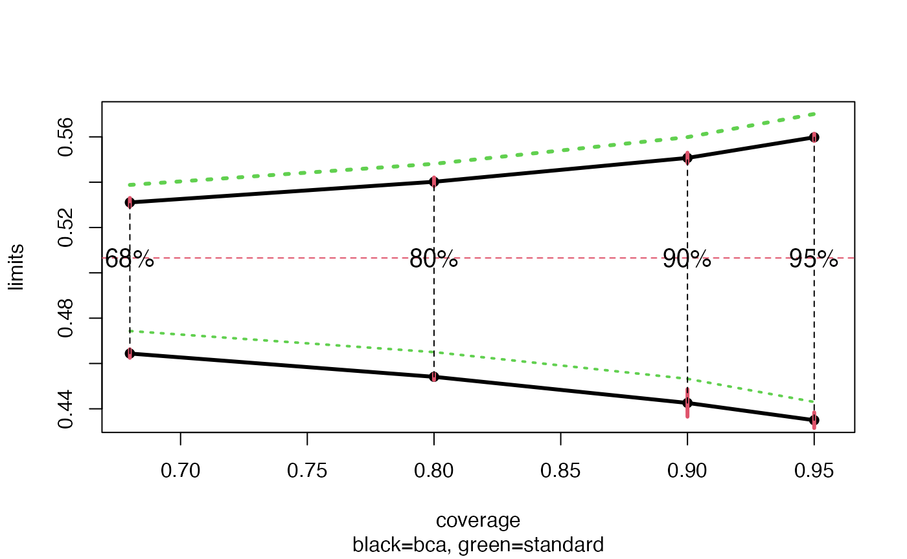
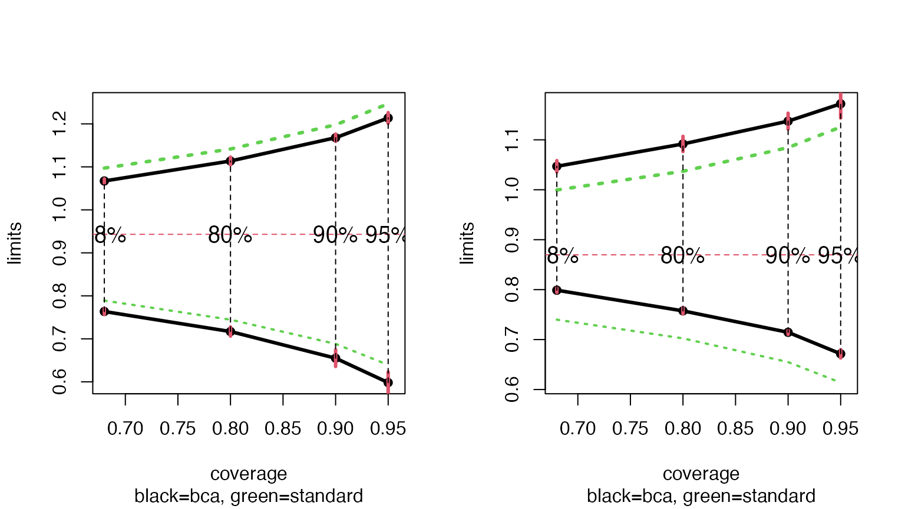
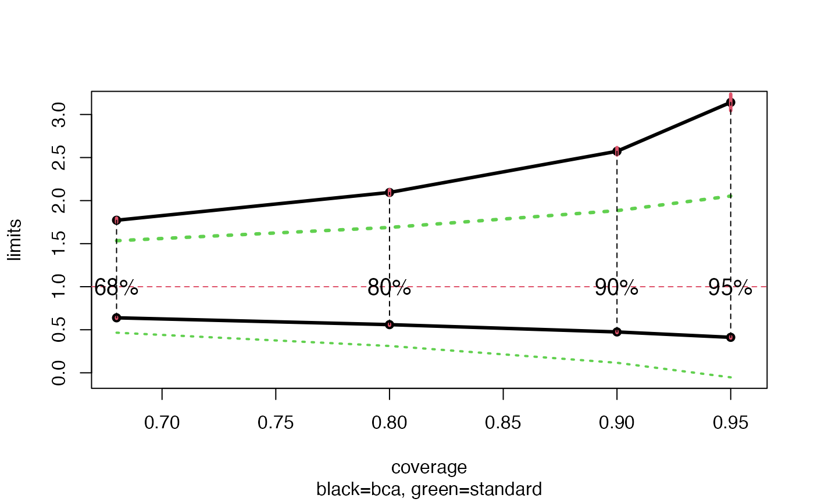

# Automatic Construction of Bootstrap Confidence Intervals

## Introduction

Bootstrap confidence intervals depend on three elements:

- the cdf of the bootstrap replications $`t_i^*`$, $`i=1\ldots B`$
- the bias-correction number
  $`z_0 = \Phi(\sum_i^B I(t_i^* < t_0) / B )`$ where $`t_0=f(x)`$ is the
  original estimate
- the acceleration number $`a`$ that measures the rate of change in
  $`\sigma_{t_0}`$ as $`x`$, the data changes.

The first two of these depend only on the bootstrap distribution, and
not how it is generated: parametrically or non-parametrically.

Package `bcaboot` aims to make construction of bootstrap confidence
intervals *almost* automatic. The three main functions for the user are:

- `bcajack` and `bcajack2` for nonparametric bootstrap
- `bcapar` for parametric bootstrap

Further details are in the Efron and Narasimhan (2018) paper. Much of
the theory behind the approach can be found in references Efron (1987),
DiCiccio and Efron (1992), DiCiccio and Efron (1996), and Efron and
Hastie (2016).

## A Nonparametric Example

Suppose we wish to construct bootstrap confidence intervals for an
$`R^2`$-statistic from a linear regression. Using the diabetes data from
the [`lars`](https://cran.r-project.org/package=lars) (442 by 11) as an
example, we use the function below to regress the `y` on `x`, a matrix
of of 10 predictors, to compute $`R^2`$.

``` r

data(diabetes, package = "bcaboot")
Xy <- cbind(diabetes$x, diabetes$y)
rfun <- function(Xy) {
    y <- Xy[, 11]
    X <- Xy[, 1:10]
    summary(lm(y ~ X) )$adj.r.squared
}
```

Constructing bootstrap confidence intervals involves merely calling
`bcajack`:

``` r

set.seed(1234)
result <- bcajack(x = Xy, B = 2000, func = rfun, verbose = FALSE)
```

The `result` contains several components. The confidence interval limits
can be obtained via

``` r

knitr::kable(result$lims, digits = 3)
```

|       |   bca | jacksd |   std |   pct |
|:------|------:|-------:|------:|------:|
| 0.025 | 0.435 |  0.003 | 0.443 | 0.006 |
| 0.05  | 0.443 |  0.006 | 0.453 | 0.015 |
| 0.1   | 0.454 |  0.001 | 0.465 | 0.035 |
| 0.16  | 0.464 |  0.002 | 0.474 | 0.065 |
| 0.5   | 0.498 |  0.001 | 0.507 | 0.306 |
| 0.84  | 0.531 |  0.002 | 0.539 | 0.685 |
| 0.9   | 0.540 |  0.002 | 0.548 | 0.778 |
| 0.95  | 0.551 |  0.002 | 0.560 | 0.869 |
| 0.975 | 0.560 |  0.002 | 0.570 | 0.923 |

The first column shows the estimated Bca confidence limits at the
requested alpha percentiles which can be compared with the standard
limits $`\theta \pm \hat{\sigma}z_{\alpha}`$ under the column titled
`standard`. The `jacksd` column jacksd gives the internal standard
errors for the Bca limits, quite small in this example. The `pct` column
gives percentiles of the ordered `B` bootstrap replications
corresponding to the Bca limits, e.g. the 91.85 percentile equals the
the .975 Bca limit .5600968.

Further details are provided by the `stats` component.

``` r

knitr::kable(result$stats, digits = 3)
```

|     | theta | sdboot |     z0 |      a | sdjack |
|:----|------:|-------:|-------:|-------:|-------:|
| est | 0.507 |  0.032 | -0.253 | -0.007 |  0.033 |
| jsd | 0.000 |  0.001 |  0.031 |  0.000 |  0.000 |

The first column `theta` is the original point estimate of the parameter
of interest, `sdboot` is its bootstrap estimate of standard error. The
quantity `z0` is the Bca bias correction value, in this case quite
negative; `a` is the acceleration, a component of the Bca limits (nearly
zero here). Finally, `sdjack` is the jackknife estimate of standard
error for `theta`.

The bottom line gives the internal standard errors for the five
quantities above. This is substantial for `z0` above.

The component `ustats` of the result provides the bias-corrected
estimator and an estimate of its sampling error.

``` r

knitr::kable(t(result$ustats), digits = 3)
```

| ustat |   sdu |
|------:|------:|
| 0.498 | 0.036 |

The resulting object can be plotted using `bcaplot`.

``` r

bcaplot(result)
```



## A Parametric Example

A logistic regression was fit to data on 812 neonates at a large clinic.
Here is a summary of the dataset.

``` r

str(neonates)
```

    ## 'data.frame':    812 obs. of  12 variables:
    ##  $ gest: num  -0.729 -0.729 1.156 -2.884 0.348 ...
    ##  $ ap  : num  0.856 0.856 0.856 -2.076 0.856 ...
    ##  $ bwei: num  -0.694 -0.694 0.786 -2.174 0.786 ...
    ##  $ gen : num  1.227 -0.814 -0.814 1.227 -0.814 ...
    ##  $ resp: num  0.78 -0.939 1.639 1.639 1.639 ...
    ##  $ head: num  -0.402 -0.402 -0.402 -0.402 -0.402 ...
    ##  $ hr  : num  -0.256 -0.256 -0.256 -0.256 -0.256 ...
    ##  $ cpap: num  1.866 -0.535 1.866 1.866 1.866 ...
    ##  $ age : num  -0.94 -0.94 -0.94 -0.94 1.06 ...
    ##  $ temp: num  -0.669 -0.669 -0.669 -0.669 2.339 ...
    ##  $ size: num  0.484 -1.319 -1.319 0.484 0.484 ...
    ##  $ y   : int  1 1 1 1 1 1 1 1 1 1 ...

The goal was to predict death versus survival—$`y`$ is 1 or 0,
respectively—on the basis of 11 baseline variables of which one of them
`resp` was of particular concern. (There were 207 deaths and 605
survivors.) So here $`\theta`$, the parameter of interest is the
coefficient of `resp`. Discussions with the investigator suggested a
weighting of 4 to 1 of deaths versus non-deaths.

### A Logistic Model

``` r

weights <- with(neonates, ifelse(y == 0, 1, 4))
glm_model <- glm(formula = y ~ ., family = "binomial", weights = weights, data = neonates)
summary(glm_model)
```

    ## 
    ## Call:
    ## glm(formula = y ~ ., family = "binomial", data = neonates, weights = weights)
    ## 
    ## Coefficients:
    ##             Estimate Std. Error z value Pr(>|z|)    
    ## (Intercept) -0.26510    0.07598  -3.489 0.000485 ***
    ## gest        -0.70602    0.13117  -5.383 7.35e-08 ***
    ## ap          -0.78594    0.07874  -9.982  < 2e-16 ***
    ## bwei        -0.23332    0.12592  -1.853 0.063879 .  
    ## gen         -0.04107    0.07355  -0.558 0.576594    
    ## resp         0.94306    0.08974  10.509  < 2e-16 ***
    ## head         0.04813    0.08057   0.597 0.550299    
    ## hr           0.03504    0.07191   0.487 0.626045    
    ## cpap         0.43438    0.08869   4.898 9.70e-07 ***
    ## age          0.15727    0.08492   1.852 0.064041 .  
    ## temp        -0.05960    0.08506  -0.701 0.483520    
    ## size        -0.37477    0.09919  -3.778 0.000158 ***
    ## ---
    ## Signif. codes:  0 '***' 0.001 '**' 0.01 '*' 0.05 '.' 0.1 ' ' 1
    ## 
    ## (Dispersion parameter for binomial family taken to be 1)
    ## 
    ##     Null deviance: 1951.7  on 811  degrees of freedom
    ## Residual deviance: 1187.2  on 800  degrees of freedom
    ## AIC: 1211.2
    ## 
    ## Number of Fisher Scoring iterations: 5

Parametric bootstrapping in this context requires us to independently
sample the response according to the estimated probabilities from
regression model. As discussed in the paper accompanying this software,
routine `bcapar` also requires sufficient statistics
$`\hat{\beta} = M^\prime y`$ where $`M`$ is the model matrix. Therefore,
it makes sense to have a function do the work. The function `glm_boot`
below returns a list of the estimate $`\hat{\theta}`$, the bootstrap
estimates, and the sufficient statistics.

``` r

glm_boot <- function(B, glm_model, weights, var = "resp") {
    pi_hat <- glm_model$fitted.values
    n <- length(pi_hat)
    y_star <- sapply(seq_len(B), function(i) ifelse(runif(n) <= pi_hat, 1, 0))
    beta_star <- apply(y_star, 2, function(y) {
        boot_data <- glm_model$data
        boot_data$y <- y
        coef(glm(formula = y ~ ., data = boot_data, weights = weights, family = "binomial"))
    })
    list(theta = coef(glm_model)[var],
         theta_star = beta_star[var, ],
         suff_stat = t(y_star) %*% model.matrix(glm_model))
}
```

Now we can compute the bootstrap estimates using `bcapar`.

``` r

set.seed(3891)
glm_boot_out <- glm_boot(B = 2000, glm_model = glm_model, weights = weights)
glm_bca <- bcapar(t0 = glm_boot_out$theta,
                  tt = glm_boot_out$theta_star,
                  bb = glm_boot_out$suff_stat)
```

We can examine the bootstrap limits and statistics.

``` r

knitr::kable(glm_bca$lims, digits = 3)
```

|       |   bca | jacksd |   std |   pct |
|:------|------:|-------:|------:|------:|
| 0.025 | 0.598 |  0.025 | 0.639 | 0.006 |
| 0.05  | 0.655 |  0.019 | 0.688 | 0.016 |
| 0.1   | 0.717 |  0.011 | 0.745 | 0.040 |
| 0.16  | 0.764 |  0.007 | 0.789 | 0.073 |
| 0.5   | 0.913 |  0.004 | 0.943 | 0.333 |
| 0.84  | 1.067 |  0.005 | 1.097 | 0.710 |
| 0.9   | 1.114 |  0.009 | 1.142 | 0.797 |
| 0.95  | 1.168 |  0.008 | 1.198 | 0.880 |
| 0.975 | 1.214 |  0.013 | 1.247 | 0.930 |

``` r

knitr::kable(glm_bca$stats, digits = 3)
```

|     | theta |    sd |      a |     az |     z0 |     A |   sdd |  mean |
|:----|------:|------:|-------:|-------:|-------:|------:|------:|------:|
| est | 0.943 | 0.155 | -0.019 | -0.001 | -0.215 | 0.006 | 0.129 | 0.982 |
| jsd | 0.000 | 0.002 |  0.007 |  0.010 |  0.027 | 0.025 | 0.005 | 0.004 |

Our bootstrap standard error using $`B=2000`$ samples for `resp` can be
read off from the last table as $`0.943\pm 0.155`$. We can also see a
small upward bias from the fact that 0.585 proportion of bootstrap
replicates were above $`0.943`$. This is also reflected in the
bias-corrector term $`\hat{z}_0= -0.215`$ in the table above with an
internal standard error of \$0.024.

### A Penalized Logistic Model

Now suppose we wish to use a nonstandard estimation procedure, for
example, via the `glmnet` package, which uses cross-validation to figure
out a best fit, corresponding to a penalization parameter $`\lambda`$
(named `lambda.min`).

``` r

X <- as.matrix(neonates[, seq_len(11)]) ; Y <- neonates$y;
glmnet_model <- glmnet::cv.glmnet(x = X, y = Y, family = "binomial", weights = weights)
```

We can examine the estimates at the `lambda.min` as follows.

``` r

coefs <- as.matrix(coef(glmnet_model, s = glmnet_model$lambda.min))
knitr::kable(data.frame(variable = rownames(coefs), coefficient = coefs[, 1]), row.names = FALSE, digits = 3)
```

| variable    | coefficient |
|:------------|------------:|
| (Intercept) |      -0.212 |
| gest        |      -0.540 |
| ap          |      -0.687 |
| bwei        |      -0.268 |
| gen         |       0.000 |
| resp        |       0.870 |
| head        |       0.000 |
| hr          |       0.000 |
| cpap        |       0.382 |
| age         |       0.050 |
| temp        |       0.000 |
| size        |      -0.221 |

Following the lines above, we create a helper function to perform the
bootstrap.

``` r

glmnet_boot <- function(B, X, y, glmnet_model, weights, var = "resp") {
    lambda <- glmnet_model$lambda.min
    theta <- as.matrix(coef(glmnet_model, s = lambda))
    pi_hat <- predict(glmnet_model, newx = X, s = "lambda.min", type = "response")
    n <- length(pi_hat)
    y_star <- sapply(seq_len(B), function(i) ifelse(runif(n) <= pi_hat, 1, 0))
    beta_star <- apply(y_star, 2,
                       function(y) {
                           as.matrix(coef(glmnet::glmnet(x = X, y = y, lambda = lambda, weights = weights, family = "binomial")))
                       })

    rownames(beta_star) <- rownames(theta)
    list(theta = theta[var, ],
         theta_star = beta_star[var, ],
         suff_stat = t(y_star) %*% X)
}
```

And off we go.

``` r

glmnet_boot_out <- glmnet_boot(B = 2000, X, y, glmnet_model, weights)
glmnet_bca <- bcapar(t0 = glmnet_boot_out$theta,
                     tt = glmnet_boot_out$theta_star,
                     bb = glmnet_boot_out$suff_stat)
```

We can compare the output of this against what we got from `glm` above.

We can examine the bootstrap limits and statistics.

``` r

knitr::kable(glmnet_bca$lims, digits = 3)
```

|       |   bca | jacksd |   std |   pct |
|:------|------:|-------:|------:|------:|
| 0.025 | 0.671 |  0.008 | 0.614 | 0.128 |
| 0.05  | 0.715 |  0.004 | 0.655 | 0.206 |
| 0.1   | 0.757 |  0.006 | 0.702 | 0.325 |
| 0.16  | 0.799 |  0.005 | 0.740 | 0.434 |
| 0.5   | 0.926 |  0.005 | 0.870 | 0.797 |
| 0.84  | 1.047 |  0.011 | 1.000 | 0.966 |
| 0.9   | 1.092 |  0.015 | 1.037 | 0.982 |
| 0.95  | 1.137 |  0.016 | 1.084 | 0.993 |
| 0.975 | 1.172 |  0.028 | 1.126 | 0.997 |

``` r

knitr::kable(glmnet_bca$stats, digits = 3)
```

|     | theta |    sd |      a |     az |    z0 |      A |   sdd |  mean |
|:----|------:|------:|-------:|-------:|------:|-------:|------:|------:|
| est |  0.87 | 0.131 | -0.003 | -0.025 | 0.415 | -0.011 | 0.104 | 0.818 |
| jsd |  0.00 | 0.002 |  0.010 |  0.012 | 0.023 |  0.034 | 0.004 | 0.003 |

The shrinkage is evident; we now have the bootstrap estimate is now
$`0.862\pm 0.127`$. In fact, we now have only 0.339 proportion of
bootstrap replicates above $`0.862`$. Therefore, the bias corrector is
large: $`\hat{z}_0 =
0.411.`$

Finally, we can plot both the `glm` and `glmnet` results side-by-side.



## Ratio of Independent Variance Estimates

Assume we have two independent estimates of variance from normal theory:

``` math
\hat{\sigma}_1^2\sim\frac{\sigma_1^2\chi_{n_1}^2}{n_1},
```

and

``` math
\hat{\sigma}_2^2\sim\frac{\sigma_2^2\chi_{n_2}^2}{n_2}.
```

Suppose now that our parameter of interest is

``` math
    \theta=\frac{\sigma_1^2}{\sigma_2^2}
```

for which we wish to compute confidence limits. In this setting, theory
yields exact limits:

``` math
\hat{\theta}(\alpha) = \frac{\hat{\theta}}{F_{n_1,n_2}^{1-\alpha}}.
```

We can apply `bcapar` to this problem. As before, here are our helper
functions.

``` r

ratio_boot <- function(B, v1, v2) {
    s1 <- sqrt(v1) * rchisq(n = B, df = n1)  / n1
    s2 <- sqrt(v2) * rchisq(n = B, df = n2)  / n2
    theta_star <- s1 / s2
    beta_star <- cbind(s1, s2)
    list(theta = v1 / v2,
         theta_star = theta_star,
         suff_stat = beta_star)
}

funcF <- function(beta) {
    beta[1] / beta[2]
}
```

Note that we have an additional function `funcF` which corresponds to
$`\tau(\hat{\beta}^*)`$ in the paper. This is the function expressing
the parameter of interest as as a function of the sample.

``` r

B <- 16000; n1 <- 10; n2 <- 42
ratio_boot_out <- ratio_boot(B, 1, 1)
ratio_bca <- bcapar(t0 = ratio_boot_out$theta,
                 tt = ratio_boot_out$theta_star,
                 bb = ratio_boot_out$suff_stat, func = funcF)
```

The limits obtained are shown below, along with the exact limits as the
last column.

``` r

exact <- 1 / qf(df1 = n1, df2 = n2, p = 1 - as.numeric(rownames(ratio_bca$lims)))
knitr::kable(cbind(ratio_bca$lims, exact = exact), digits = 3)
```

|       |   bca | jacksd |    std |   pct |   abc | exact |
|:------|------:|-------:|-------:|------:|------:|------:|
| 0.025 | 0.412 |  0.008 | -0.053 | 0.068 | 0.405 | 0.422 |
| 0.05  | 0.475 |  0.007 |  0.117 | 0.103 | 0.472 | 0.484 |
| 0.1   | 0.559 |  0.007 |  0.312 | 0.164 | 0.562 | 0.570 |
| 0.16  | 0.639 |  0.006 |  0.466 | 0.228 | 0.646 | 0.650 |
| 0.5   | 1.046 |  0.006 |  1.000 | 0.570 | 1.057 | 1.053 |
| 0.84  | 1.772 |  0.025 |  1.534 | 0.903 | 1.813 | 1.800 |
| 0.9   | 2.095 |  0.032 |  1.688 | 0.953 | 2.154 | 2.128 |
| 0.95  | 2.573 |  0.043 |  1.883 | 0.985 | 2.726 | 2.655 |
| 0.975 | 3.141 |  0.096 |  2.053 | 0.996 | 3.416 | 3.247 |

Clearly the bca limits match the exact values very well and suggests a
large upward correction to the standard limits. Here the corrections are
all positive as seen in the table below; $`\hat{z}_0 = 0.093`$ and
$`\hat{a} = 0.092`$.

``` r

knitr::kable(ratio_bca$stats, digits = 3)
```

|     | theta |    sd |     a |    az |    z0 |     A |   sdd |  mean |
|:----|------:|------:|------:|------:|------:|------:|------:|------:|
| est |     1 | 0.537 | 0.098 | 0.089 | 0.088 | 0.509 | 0.504 | 1.054 |
| jsd |     0 | 0.005 | 0.005 | 0.005 | 0.010 | 0.020 | 0.004 | 0.004 |

``` r

knitr::kable(t(ratio_bca$abcstats), digits = 3)
```

|   a |  z0 |
|----:|----:|
| 0.1 | 0.1 |

``` r

knitr::kable(ratio_bca$ustats, digits = 3)
```

|     | ustat |   sdu |     B |
|:----|------:|------:|------:|
| est | 0.946 | 0.490 | 16000 |
| jsd | 0.004 | 0.004 |     0 |

The plot below shows that there is moderate amount of internal error in
$`\hat{\theta}_{bca}(0.975)`$ as shown by the red bar. The `pct` column
suggests why: $`\hat{\theta}_{bca}(0.975)`$ occurs at the
$`0.996`$-quantile of the 16,000 replications, i.e., at the 64th largest
$`\hat{\theta}`$, where there is a limited amount of data for estimating
the distribution.

``` r

bcaplot(ratio_bca)
```



## References

DiCiccio, Thomas J., and Bradley Efron. 1996. “Bootstrap Confidence
Intervals.” *Statist. Sci.* 11 (3): 189–228.
<https://doi.org/10.1214/ss/1032280214>.

DiCiccio, Thomas, and Bradley Efron. 1992. “More Accurate Confidence
Intervals in Exponential Families.” *Biometrika* 79 (2): 231–45.
<https://doi.org/10.2307/2336835>.

Efron, Bradley. 1987. “Better Bootstrap Confidence Intervals.” *Journal
of the American Statistical Association* 82 (397): 171–85.
<https://doi.org/10.2307/2289144>.

Efron, Bradley, and Trevor Hastie. 2016. *Computer Age Statistical
Inference: Algorithms, Evidence, and Data Science*. 1st ed. Cambridge
University Press.

Efron, Bradley, and Balasubramanian Narasimhan. 2018. *The Automatic
Construction of Bootstrap Confidence Intervals*.
